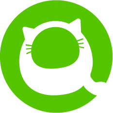

# プロフィール

## 自己紹介

* `ハンドルネーム`: ymsk-sky
* `誕生年`: 1993年
* `所在地`: 千葉県
* `現職`: AI開発エンジニア

## スキル

### 言語
- python
- C

### ライブラリ

### ツール
- Git
- Docker

## つくったもの

### Kakizome
`Ruby on Rails`で[Railsチュートリアル](https://railstutorial.jp/)を参考に作成.  
加えて, html, javascriptのcanvasに文字を書けるような所謂ペイント機能を実装.

### picshare
フロントエンドを`Vue.js`, バックエンドを`Laravel`で作成.  
また, `Docker`(`Docker Compose`)による仮想環境構築を行い, その学習も兼ねていた.

### mute_booth
`Chrome拡張機能`を初めて作成してみた.  
ノウハウや動作の書き方について`ChatGPT(3.5)`へプロンプトを投げ, 自分の実装したいことをコードに落とし込んでもらい調整しながら実装した.

## コンタクト

&ensp;
&ensp;
&ensp;
&ensp;
